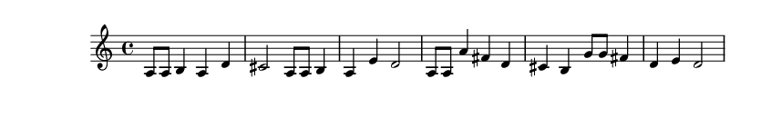

# concertc: the music compiler

concertc is a program that converts a new kind of music file to a lilypond file (can be converted to sheet music).

## installation

To install concertc, you'll need cmake. Run: `mkdir build; cmake -B build; cmake --build build; cmake --install build` and then you will be able to use the concertc command.

If you actually want to use it, you'll also need lilypond. Get it at https://lilypond.org/download.html.

## usage

`concertc src.concert dest.ly (C|Bb|Eb|F) {pitch offset} (treble|bass)`

 - src.concert: name of source file
 - dest.ly: name of destination file
 - (C|Bb|Eb|F): type of instrument
 - {pitch offset}: start at 0, and tweak as needed for instrument
 - (treble|bass): type of clef

To understand the file format, see the examples.

## examples

### For Bb clarinet:

```
concertc happy-birthday.concert hb.ly Bb 1 treble
lilypond --png hb.ly
```



### For Flute:

```
concertc happy-birthday.concert hb.ly C 2 treble`
lilypond --png hb.ly
```


## Combined examples for Flute, Bb clarinet, and Alto Saxophone


